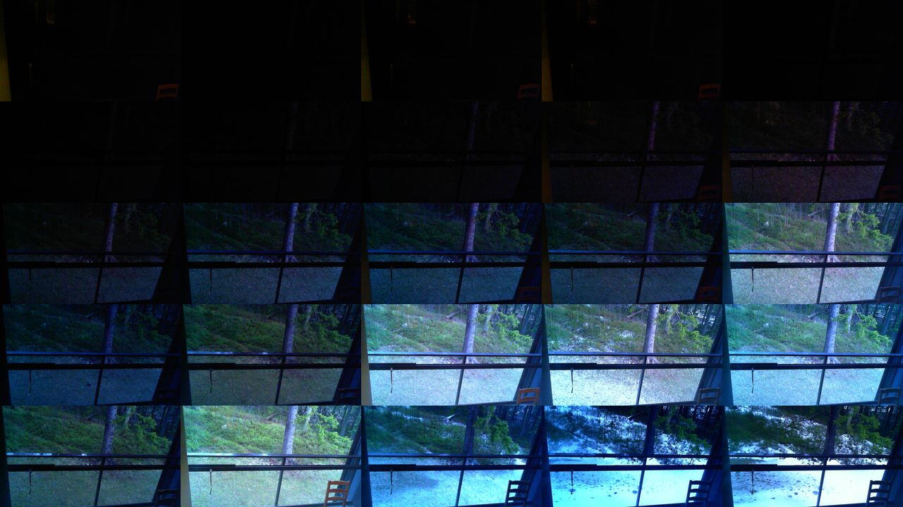
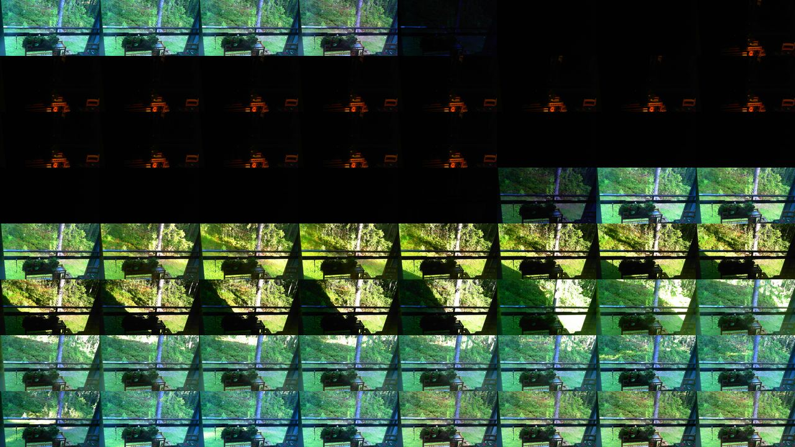
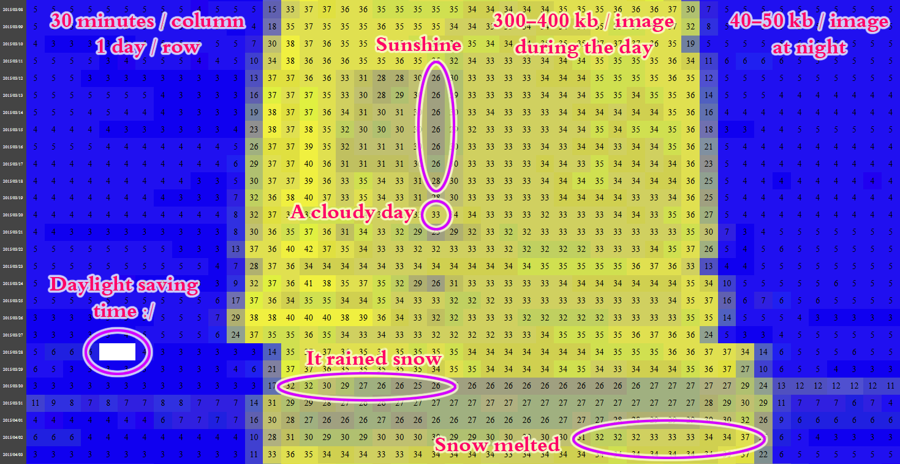

WebcamMon
=================
This project consists of the following parts
- Automated image capturing from a webcam (bash, [v4l2-ctl](http://www.ivtvdriver.org/index.php/V4l2-ctl))
- Parallel video generation (bash, [mencoder](http://www.mplayerhq.hu/design7/news.html))
- An API to query filesize statistics, just the size is surprisingly informative (PHP)
- An API to generate images from different time-based criteria (PHP, [montage](http://www.imagemagick.org/script/montage.php))
- An UI to visualize filesize statistics (HTML)

This project is not and will not be public on the internet due to privacy concerns.

Usage
--------
At simplest just clone the repo, change a few paths and put bin/grabFrame.sh into crontab.
PHP API should be easy to get up and running as well. 1280x720 JPGs are 3-4 kb at night and up-to
40 kb during the day, depending on the season it is 300 - 350 Mb / day if you capture once every minute.

URL examples
--------
/images/2015-04-06-05-45-01
The image at time, Nginx rewrites it as /images/2015-04-06/05-45-01.jpg

/image_gen?recent
The most recently captured image

/image_gen/07.jpg?w=1280&grid=5
Tiled last 25 (5 x 5) images at 7am, rendered to a 1280 x 720 size.


/image_gen/1d.jpg?w=1280&grid=8&skip=30w
Tiled 64 (8 x 8) images throughout one day 30 weeks ago, 22.5 minutes / image.


/filesizes.html
Calls the filesize API and renders the outcome as a HTML table.


Supported time syntaxes (case-insensitive)
--------
- i = minute
- h = hour
- d = day
- w = week
- m = month (30 days)

So currently accepted strings are "[0-9]+[ihdwm]", no decimal part is allowed.

API examples
--------
Median file sizes at each hour, first three columns are the year, month and day. This is trivial to load in for example Matlab.
/api/fileSizes.txt?dt=1
```
  -1 -1 -1   0.00   1.00   2.00   3.00   4.00   5.00   6.00   7.00   8.00   9.00  10.00  11.00  12.00  13.00  14.00  15.00  16.00  17.00  18.00  19.00  20.00  21.00  22.00  23.00
2015 03 26  52.20  32.20  31.50  31.20  42.20  53.90 176.80 380.60 402.70 389.10 374.80 332.90 317.80 330.40 324.80 321.70 321.70 327.40 329.30 349.80  97.40  53.20  36.90  32.40
2015 03 27  32.30  32.10  31.60  33.90  53.20  53.00 147.60 357.50 351.30 341.90 335.60 328.60 324.40 324.20 331.20 343.70 347.40 358.80 363.50 298.90  40.90  37.00  52.90  52.40
2015 03 28  52.70  57.90  64.50  37.60  30.60  30.60  86.80 356.20 363.00 349.70 348.90 349.30 342.60 339.80 341.40 343.60 348.40 351.90 363.20 352.90  98.00  52.60  54.60  53.70
2015 03 29  51.90  30.50  30.70  30.70  30.50  36.80 132.20 370.60 358.90 349.40 348.40 346.20 343.70 342.30 342.50 341.40 335.40 342.10 355.60 318.50  79.40  53.40  35.50  32.10
2015 03 30  31.20  31.00  30.40  30.70  30.50  30.70 100.70 315.90 293.60 267.30 255.70 256.40 258.50 256.70 257.90 259.00 260.20 267.10 271.90 283.70 186.70 123.60 120.30 113.30
2015 03 31  96.40  77.30  74.40  74.30  76.30  72.00 225.10 290.10 276.70 262.60 266.30 268.40 271.70 271.80 270.50 269.80 268.70 268.60 276.10 296.20 198.40  70.80  64.40  56.00
2015 04 01  41.40  39.00  40.60  50.50  68.50  66.30 231.00 272.90 257.70 265.40 260.30 263.50 265.50 262.60 264.80 271.70 278.20 285.90 293.30 312.50 171.40  60.70  61.30  60.50
2015 04 02  60.40  49.30  37.60  38.00  37.80  38.60 187.20 303.00 294.80 296.50 299.40 294.20 293.80 300.30 303.00 312.80 323.00 329.50 333.90 353.20 158.80  42.20  32.70  31.50
2015 04 03  31.40  31.60  31.80  31.60  31.50  32.50 217.90 359.90 340.50 334.70 338.10 341.90 337.30 336.40 339.50 340.40 343.50 342.60 342.50 360.80 136.60  53.40  53.60  53.50
2015 04 04  53.50  53.90  53.80  43.70  30.70  31.80 182.00 366.70 350.10 343.20 346.20 344.00 342.60 341.40 338.50 343.10 346.50 349.70 347.90 327.70 191.00  69.30  45.70  41.90
```

Same as above but in a JSON format for an AJAX call, this also lists filenames so that image URLs can be easily generated on the UI.
Note that these are in server's timezone but filenames are in UTC.

/api/fileSizes.json?dt=1
```{
    "metadata": {
        "times": [
            "00.00h",
            "01.00h",
            "02.00h",
            "03.00h",
            "04.00h",
            "05.00h",
            "06.00h",
            "07.00h",
            "08.00h",
            "09.00h",
            "10.00h",
            "11.00h",
            "12.00h",
            "13.00h",
            "14.00h",
            "15.00h",
            "16.00h",
            "17.00h",
            "18.00h",
            "19.00h",
            "20.00h",
            "21.00h",
            "22.00h",
            "23.00h"
        ],
        "files": {
            "2015/03/26": {
                "00.00h": "2015-03-25-21-30-02",
                "01.00h": "2015-03-25-22-30-01",
                "02.00h": "2015-03-25-23-30-01",
                "03.00h": "2015-03-26-00-30-01",
                "04.00h": "2015-03-26-01-30-01",
                "05.00h": "2015-03-26-02-30-01",
                "06.00h": "2015-03-26-03-30-01",
                "07.00h": "2015-03-26-04-30-01",
                "08.00h": "2015-03-26-05-30-01",
                "09.00h": "2015-03-26-06-30-02",
                "10.00h": "2015-03-26-07-30-01",
                "11.00h": "2015-03-26-08-30-01",
                "12.00h": "2015-03-26-09-30-01",
                "13.00h": "2015-03-26-10-30-02",
                "14.00h": "2015-03-26-11-30-01",
                "15.00h": "2015-03-26-12-30-01",
                "16.00h": "2015-03-26-13-30-01",
                "17.00h": "2015-03-26-14-30-01",
                "18.00h": "2015-03-26-15-30-02",
                "19.00h": "2015-03-26-16-30-01",
                "20.00h": "2015-03-26-17-30-01",
                "21.00h": "2015-03-26-18-30-01",
                "22.00h": "2015-03-26-19-29-01",
                "23.00h": "2015-03-26-20-30-01"
            },
            "2015/03/27": {
                "00.00h": "2015-03-26-21-30-01",
                "01.00h": "2015-03-26-22-30-01",
                "02.00h": "2015-03-26-23-30-01",
                "03.00h": "2015-03-27-00-30-01",
                "04.00h": "2015-03-27-01-30-01",
                "05.00h": "2015-03-27-02-30-01",
                "06.00h": "2015-03-27-03-30-02",
                "07.00h": "2015-03-27-04-30-02",
                "08.00h": "2015-03-27-05-30-02",
                "09.00h": "2015-03-27-06-30-01",
                "10.00h": "2015-03-27-07-30-01",
                "11.00h": "2015-03-27-08-30-01",
                "12.00h": "2015-03-27-09-30-01",
                "13.00h": "2015-03-27-10-30-01",
                "14.00h": "2015-03-27-11-30-01",
                "15.00h": "2015-03-27-12-30-01",
                "16.00h": "2015-03-27-13-30-01",
                "17.00h": "2015-03-27-14-30-01",
                "18.00h": "2015-03-27-15-31-01",
                "19.00h": "2015-03-27-16-30-01",
                "20.00h": "2015-03-27-17-30-02",
                "21.00h": "2015-03-27-18-30-01",
                "22.00h": "2015-03-27-19-30-02",
                "23.00h": "2015-03-27-20-30-01"
            }
        }
    },
    "response": {
        "2015/03/26": {
            "00.00h": 52.2,
            "01.00h": 32.2,
            "02.00h": 31.5,
            "03.00h": 31.2,
            "04.00h": 42.2,
            "05.00h": 53.9,
            "06.00h": 176.8,
            "07.00h": 380.6,
            "08.00h": 402.7,
            "09.00h": 389.1,
            "10.00h": 374.8,
            "11.00h": 332.9,
            "12.00h": 317.8,
            "13.00h": 330.4,
            "14.00h": 324.8,
            "15.00h": 321.7,
            "16.00h": 321.7,
            "17.00h": 327.4,
            "18.00h": 329.3,
            "19.00h": 349.8,
            "20.00h": 97.4,
            "21.00h": 53.2,
            "22.00h": 36.9,
            "23.00h": 32.4
        },
        "2015/03/27": {
            "00.00h": 32.3,
            "01.00h": 32.1,
            "02.00h": 31.6,
            "03.00h": 33.9,
            "04.00h": 53.2,
            "05.00h": 53,
            "06.00h": 147.6,
            "07.00h": 357.5,
            "08.00h": 351.3,
            "09.00h": 341.9,
            "10.00h": 335.6,
            "11.00h": 328.6,
            "12.00h": 324.4,
            "13.00h": 324.2,
            "14.00h": 331.2,
            "15.00h": 343.7,
            "16.00h": 347.4,
            "17.00h": 358.8,
            "18.00h": 363.5,
            "19.00h": 298.9,
            "20.00h": 40.9,
            "21.00h": 37,
            "22.00h": 52.9,
            "23.00h": 52.4
        }
    }
}
```

TODO
--------
 - Clean up code
 - GIF generation
 - Tests
 - Configurable paths
 - Windows support? (pull requests are welcome)


License
-------
Copyright 2015 Niko Nyrhilä

Licensed under the Apache License, Version 2.0 (the "License");
you may not use this file except in compliance with the License.
You may obtain a copy of the License at

    http://www.apache.org/licenses/LICENSE-2.0

Unless required by applicable law or agreed to in writing, software
distributed under the License is distributed on an "AS IS" BASIS,
WITHOUT WARRANTIES OR CONDITIONS OF ANY KIND, either express or implied.
See the License for the specific language governing permissions and
limitations under the License.
